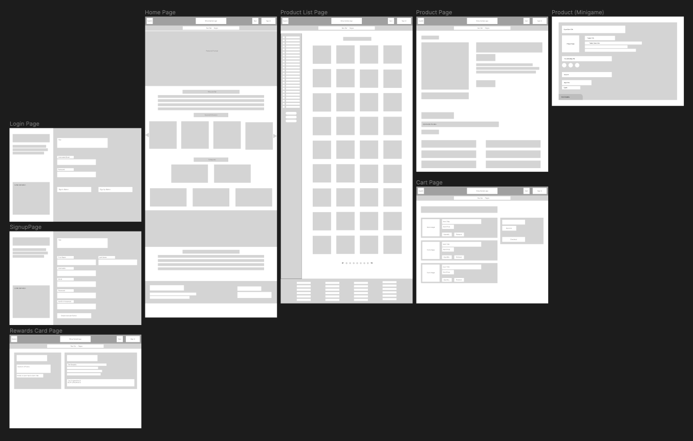
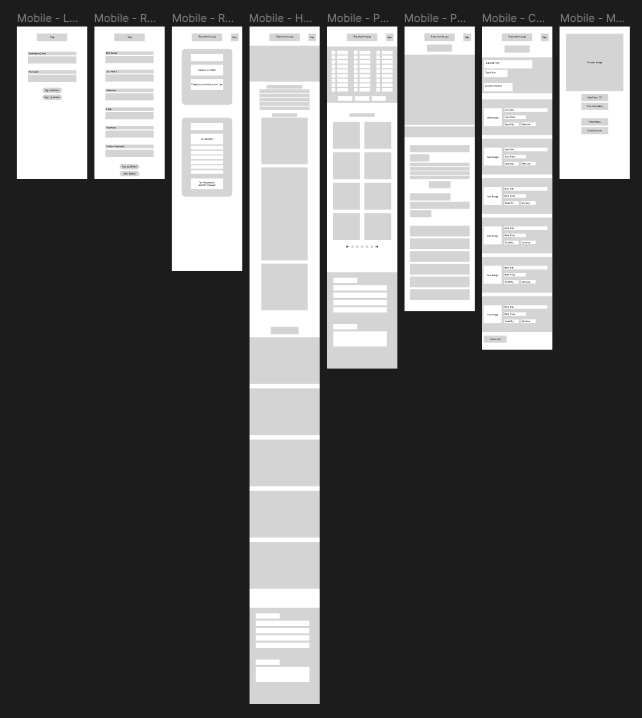

# Design Process
**UnifiedGoods** was designed to cater to diverse consumer needs. We aimed to develop a website that seamlessly combines modern aesthetics with user-friendly design. Recognising the number of products showcased, we focused on ensuring a good user experience through the implementation of reliable search and filtering functionalities.  
By implementing an interactive game which allows users to earn discounts on the products purchased, this incentivises users to shop for more products and also brings excitment to their online shopping experience.

## Design Rationale
1. **Visually Appealing**
    - We choose a cohesive [color palette](https://coolors.co/eaebed-006989-a3bac3-007090-01a7c2) to create a pleasant visual experience and evoke a sense of reliability and trust through the main blue tones. The combination with a lighter shade encourages users to explore the shop with assurance.
    - High-Resolution images to showcase our products
    - Easy-to-read fonts and strategic usage of font sizes and styles to highlight imporant information
    - Feathericons used for recognizable symbols to enchance the user interface
2. **Intuitive Design**
    - Clear and simple navigation structure
    - Easily understandable categories and labels for products
    - Search bar for quick access
    - Advanced search where user can find the items by categories instead of searching through everything
    - Responsive Design, seamless browsing experience for users across various devices and screen size
    - Clear and compelling buttons to prompt users to take actions such as adding to cart.
3. **Engagement**
    - Interactive elements such as sliders, carousels encourages users to interact with the website
    - Guess The Price Game! Where user can get a change to receive discounts by playing the game.
    - Points and tier systems to receive various benefits!

## Color Scheme

## Wireframe
The Wireframe for UnifiedGoods was created using Figma. The design shown in the wireframe may not match the final website design due to changes we have made along the way. All screens designed in the wireframe contains both Web and Mobile versions.  
You can take a look at the Wireframe [here](https://www.figma.com/file/bl20jGrulXzK39nMnRXOAM/UnifiedGoods---An-eCommerce-Platform?type=design&node-id=0%3A1&mode=design&t=z4FqGFjEwXXYYNsv-1).  
  

